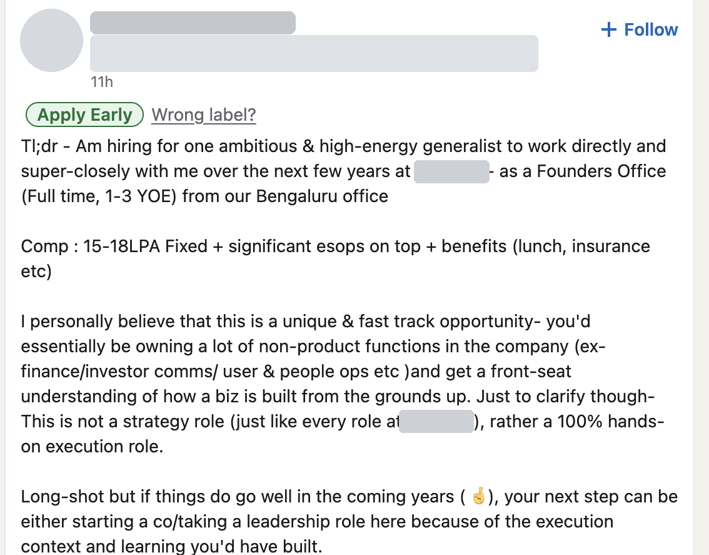
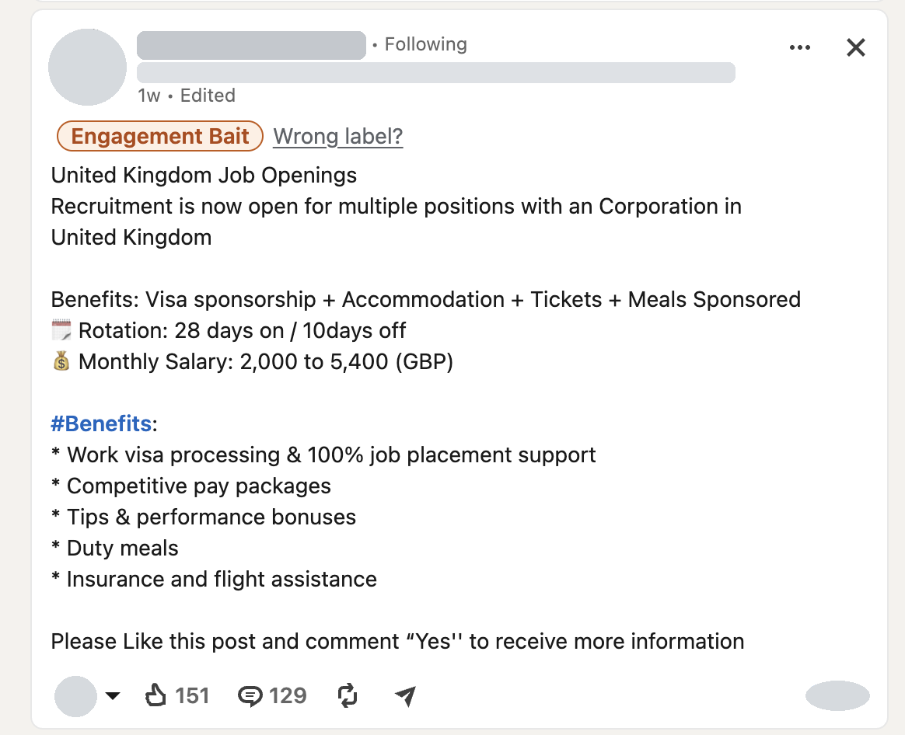
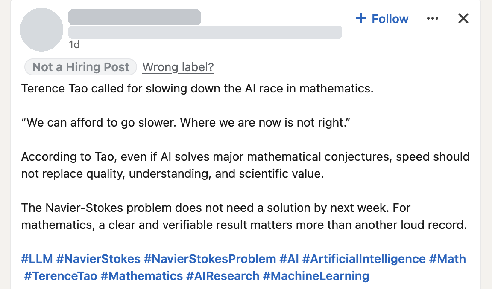

# LegitHire

A free, open-source Chrome and Safari extension that labels hiring posts in
your LinkedIn feed, so you can tell a real opening from engagement bait or a
scam at a glance. It runs entirely on your device, with no API keys, no
servers and no tracking.

<table>
  <tr>
    <td width="33%"></td>
    <td width="33%"></td>
    <td width="33%"></td>
  </tr>
  <tr>
    <td align="center"><sub>Specific role, pay and location, 11h old</sub></td>
    <td align="center"><sub>"Like and comment Yes" instead of a way to apply</sub></td>
    <td align="center"><sub>News, not a job</sub></td>
  </tr>
</table>
<p align="center"><sub>Real LinkedIn feed. Names, photos, headlines and company names are redacted.</sub></p>

| Label | Meaning |
|---|---|
| 🟢 **Apply Early** | Real opening, posted in the last 24h, fewer than 50 comments |
| 🔵 **Real Opening** | Real opening, moderate competition |
| 🟡 **Crowded** | Real opening, but 200+ comments, older than a week, or comments piling up fast |
| 🟠 **Engagement Bait** | Asks you to comment, like, follow, repost or tag to "apply", with no real way to apply |
| 🔴 **Scam Risk** | Fees or deposits, ID documents or bank details, WhatsApp/Telegram-only contact, too-good-to-be-true pay |
| ⚪ **Unverified** | Looks like hiring, but not enough evidence either way |
| ▫️ **Not a Hiring Post** | Stories, advice, "I got hired", #OpenToWork. Hidden by default |

Hover or click a label to see why, for example
`Apply link on Greenhouse · posted 5h ago · 12 comments`. Reasons are built
from fixed templates; no model ever writes text.

## Status

| | |
|---|---|
| Chrome | Working. 475 unit tests; the end-to-end test runs the built extension in real Chrome |
| LinkedIn layouts | Classic, hashed-class, and the 2026 redesign (found structurally). English UI only |
| Safari | Built (`safari/`). Needs Xcode to wrap it in an app |

## Privacy

- **Nothing leaves your browser.** No accounts, no API keys, no servers. The
  language model ships inside the extension and runs on your device. The
  extension's Content Security Policy sets `connect-src 'self'`, so the browser
  itself blocks any network request from the extension's own pages.
- **Read-only on LinkedIn.** It reads what is already on screen. It never
  clicks, comments, likes, scrolls, opens "…more", fetches LinkedIn URLs or
  makes background requests. The only change to the page is the label it adds.
- **What it reads from each post:** the text, the author's headline (only to
  check whether the poster works at the hiring company), the post's age, the
  reaction, comment and repost counts, and the links and email addresses in the post.
- **What it stores (only on your device):**
  - Today's label counts.
  - When you use "Wrong label?": a SHA-256 hash of the post ID, the predicted
    and corrected labels, and derived features (booleans and matched phrases from
    our own lists). No post text, names, profile URLs or email addresses.
  - In dataset mode, when you click "Save to dataset": the post text with the
    author's and mentioned people's names, profile links, email addresses and
    phone numbers removed. Emails keep only their type (`[email:company]` or
    `[email:free]`).
- Permissions: `storage`, `offscreen` (Chrome only), and access to `https://www.linkedin.com/*`.

## Install (from source)

Requires Node 20+ and Chrome 116+.

```sh
npm install
npm run fetch-model   # one-time download of the model into models/ (~96 MB)
npm run build         # writes the extension to dist/
```

1. Open `chrome://extensions` and turn on **Developer mode**.
2. Click **Load unpacked** and choose the `dist/` folder.
3. Open https://www.linkedin.com/feed/ and scroll.

After rebuilding, click the reload icon on the extension card and refresh LinkedIn.

**Safari:** `npm run build:safari`, then `npm run safari:xcode` (needs Xcode).
See [`safari/README.md`](safari/README.md).

`npm run fetch-model` is the only step that uses the network. It downloads the
model files from Hugging Face at build time. The installed extension never does.

> The red `chrome-extension://invalid/ net::ERR_FAILED` errors you may see in
> LinkedIn's console come from LinkedIn's own extension scan, not from LegitHire.

## Using it

The popup has four switches:

- **Label hiring posts**: turns the extension on or off.
- **Hide "Not a Hiring Post" labels**: on by default.
- **Debug mode**: logs each post's extracted data, features and model scores
  to the page console (filter by `LegitHire`). If no posts are recognised, it
  logs a layout summary that contains no post text or names.
- **Dataset mode**: adds "Save to dataset" to labels.

The popup also shows today's label counts and exports your feedback and
dataset records as JSONL.

## How it decides

1. **Extraction**: the content script finds posts as they approach the
   viewport. It uses stable hooks where LinkedIn has them (`urn:li:activity`,
   `data-view-name`). In LinkedIn's 2026 layout, where every class name is
   hashed, it finds posts structurally: each post is the largest element holding
   exactly one Like/Comment/Repost/Send bar. All selectors are in
   [`src/content/selectors.ts`](src/content/selectors.ts).
2. **Is it hiring?** No hiring keywords, or job-seeker or "I got hired" phrasing,
   means Not a Hiring Post. A trusted apply link settles it the other way.
   Otherwise one zero-shot model call decides.
3. **Features** (plain code): apply channel (applicant-tracking systems, careers
   pages, company or free email, Google Forms, WhatsApp/Telegram, link
   shorteners, "DM me"), bait and scam phrases, how specific the post is (role,
   experience, tech, location, salary), whether the poster works at the company,
   and exposure (age, comments, comments per hour).
4. **Model, only for ambiguous cases**: bait and scam checks when the rules
   leave it open.
5. **Decision table**, first match wins: Not hiring → Scam Risk → Engagement
   Bait → genuine channel (Apply Early / Crowded / Real Opening) → Unverified.
   All numbers are in [`src/config.ts`](src/config.ts).

Rules label a post instantly. Posts that need the model get their label a
moment later. The model runs in an offscreen document (Chrome) or the
background page (Safari), one post at a time,
never on LinkedIn's main thread, and results are cached per post for the
browser session.

### Model

The model is `Xenova/nli-deberta-v3-xsmall` (q8), run with Transformers.js and
ONNX Runtime WebAssembly. Swapping models is a one-line change to `MODEL_ID` in
[`src/config.ts`](src/config.ts); compare them with the eval script below.

## Evaluating on real posts

1. Turn on dataset mode and click **Save to dataset** on posts as you scroll.
2. Export the dataset from the popup, fill in `gold_label` for each line (one
   of `apply_early`, `real_opening`, `crowded`, `engagement_bait`, `scam_risk`,
   `unverified`, `not_hiring`), and save it as `data/labeled.jsonl`.
   Optionally add `"split": "dev"` or `"test"`; otherwise 20% of posts go to
   test, chosen by a stable hash of the text.
3. Run:

```sh
npm run eval -- --split dev            # accuracy, per-label precision/recall, confusion matrix
npm run eval -- --split dev --sweep    # search model thresholds on dev
npm run eval -- --split test           # report once; never tune on test
npm run eval -- --no-model -v          # rules only, printing each mistake
npm run eval -- --model <id>           # compare another model (npm run fetch-model -- <id>)
```

The eval runs the exact extension logic in Node, offline, from `models/`.

## Development

```sh
npm test            # unit tests: rules, age parsing, decision table, redaction, extraction fixtures
npm run typecheck
npm run e2e         # real Chrome + the built extension, against the fixture posts
```

`npm run e2e` intercepts `https://www.linkedin.com/feed/` locally, so it never
contacts LinkedIn. It checks posts, labels, model scoring, feedback, dataset
redaction and popup stats, and fails if any extension page makes a network request.

```
src/
  content/     selectors.ts, extract.ts (post reading), badge.ts, index.ts
  background/  core.ts (shared), sw.ts (Chrome, uses offscreen), safari.ts (model in background page)
  offscreen/   Chrome's model host
  model/       model loading (browserModel.ts) and zero-shot scoring shared with the eval script
  rules/       domains.ts, phrases.ts, features.ts, age.ts, anonymize.ts
  decide/      decision table, reason templates
  popup/       settings, stats, export
  storage/     IndexedDB (feedback, dataset), daily stats
  config.ts    model ID and every threshold
fixtures/posts/  synthetic post HTML (classic, hashed-class and 2026 layouts)
data/            synthetic.jsonl; your labeled.jsonl goes here
safari/          Safari build output, Xcode project script, Safari README
scripts/         build, fetch-model, eval, e2e
```

## Contributing

- **Phrases** (hiring keywords, bait, scam, job-seeker phrasing):
  [`src/rules/phrases.ts`](src/rules/phrases.ts). Write them in plain lowercase.
  Matching ignores case, punctuation, quotes and hashtags, and works on whole
  words, so `we're hiring` matches "We’re HIRING!". A test checks that every
  entry matches itself.
- **Domains** (applicant-tracking systems, free email, shorteners, messaging):
  [`src/rules/domains.ts`](src/rules/domains.ts).
- **When LinkedIn changes its layout**: turn on debug mode, fix
  [`selectors.ts`](src/content/selectors.ts), and add a post to
  `fixtures/posts/` with every name, photo, profile URL and email replaced.
- Measure every change with `npm run eval -- --split dev` before and after.

Known limits: English-language LinkedIn UI only (action-bar labels and counts
are matched in English); the destination of `lnkd.in` short links isn't visible
on the page, so those links count only when the post has specific role details.

## License

MIT. LegitHire is an independent project and is not affiliated with,
endorsed by or sponsored by LinkedIn.
